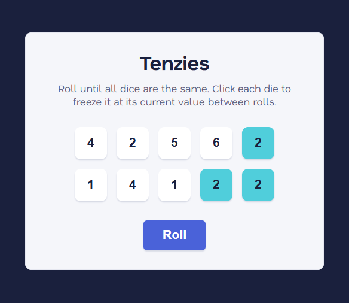

# 🎲 Tenzies

<div align="center">
  
</div>

<br>

<div align="center">


</div>

> Roll until all ten dice show the same number. Click a die to freeze it between rolls.

---

## How to play

1. Press **Roll** to roll all ten dice.
2. Click any die to **freeze** it at its current value.
3. Keep rolling — frozen dice stay put.
4. Win when all ten dice show the **same number**.

---

## Getting started

```bash
npm install
npm run dev
```

---

## Tech stack

| Tool                      | Purpose                                   |
| ------------------------- | ----------------------------------------- |
| React 19                  | UI & state management                     |
| Vite 8                    | Dev server & bundler                      |
| react-confetti            | Win celebration                           |
| CSS Custom Properties     | Design tokens — colors, type, space       |
| Fluid type scale (Utopia) | Responsive typography without breakpoints |

---

## Planned improvements

### Gameplay

- [x] **Roll counter** — display how many rolls the current game took
- [ ] **Stopwatch** — track elapsed time per game
- [ ] **Best score** — persist fastest time & fewest rolls to `localStorage`
- [ ] **Difficulty modes** — Easy (6-sided), Hard (10-sided or 12 dice)

### UI / UX

- [ ] **Dice roll animation** — brief shake on unfreeze-and-roll
- [ ] **Held indicator** — checkmark or ring on frozen dice beyond the bg color change
- [x] **Dark mode toggle** — design tokens already support theming
- [ ] **Win screen** — score summary overlay before resetting

### Accessibility

- [ ] **Keyboard navigation** — arrow keys to move between dice, `Space` to freeze
- [ ] **Reduced-motion support** — `prefers-reduced-motion` disables transitions & confetti
- [ ] **Screen reader announcements** — `aria-live` region for roll results

### Code quality

- [ ] **`useTenzies` custom hook** — extract game logic out of `App.jsx`
- [ ] **Vitest unit tests** — cover `generateAllNewDice`, `hold`, and win condition
